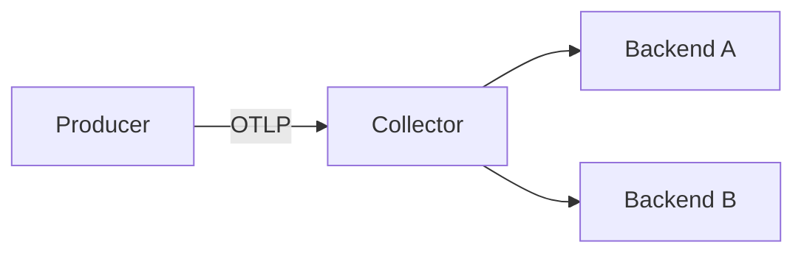
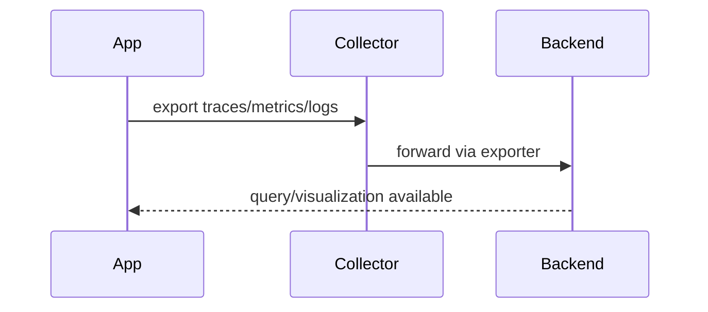
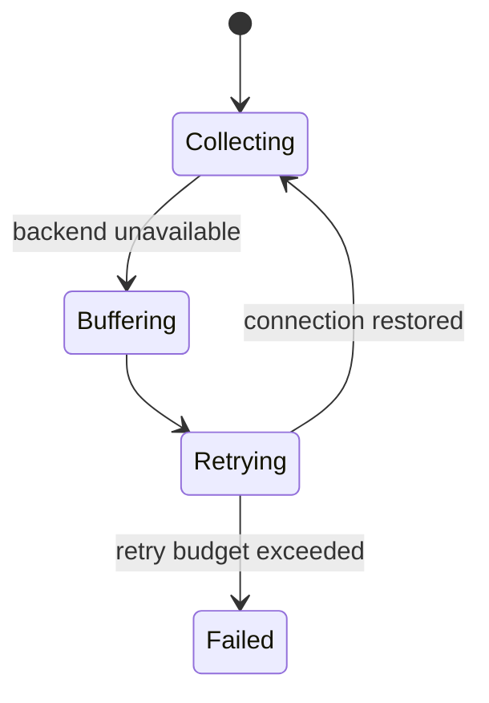
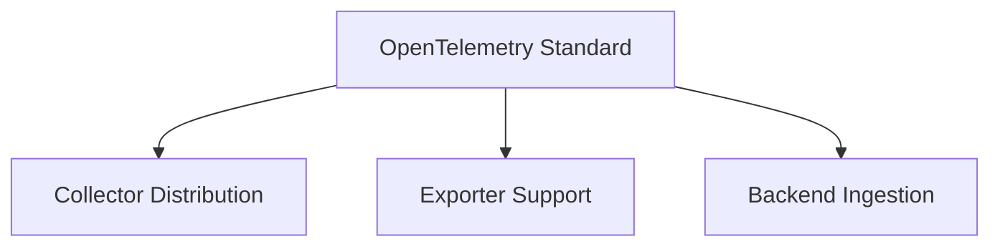
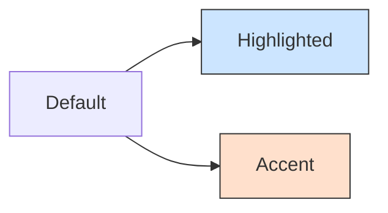
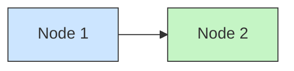

# Mermaid Diagram Templates

## 1) Architecture / Data Flow

Use for: platform architecture, observability pipelines, integration maps.

## 2) Sequence

Use for: runtime interactions, request lifecycle, protocol handshake.

## 3) State

Use for: collector lifecycle, retry/error behavior, control loops.

## 4) Dependency / Ownership

Use for: support boundaries, standards alignment, capability mapping.

## 5) Styling for Readability

When using custom fill colors, always set an explicit text `color` so nodes stay readable in both light and dark themes.

For reusable classes:

Rule: every `fill` must be paired with a contrasting `color`. Light fills get `color:#333`; dark fills get `color:#fff`.
